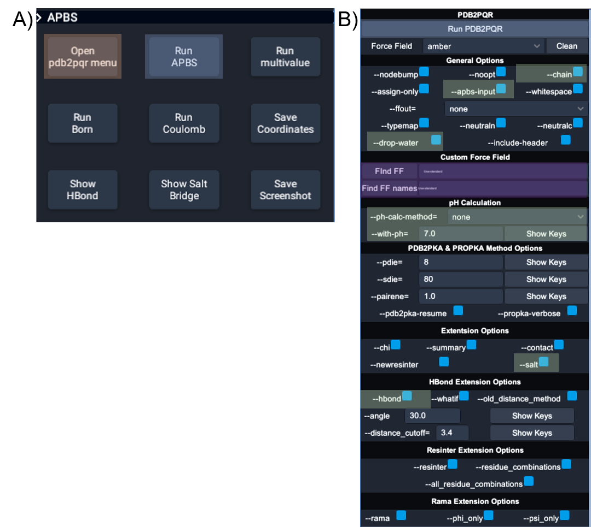
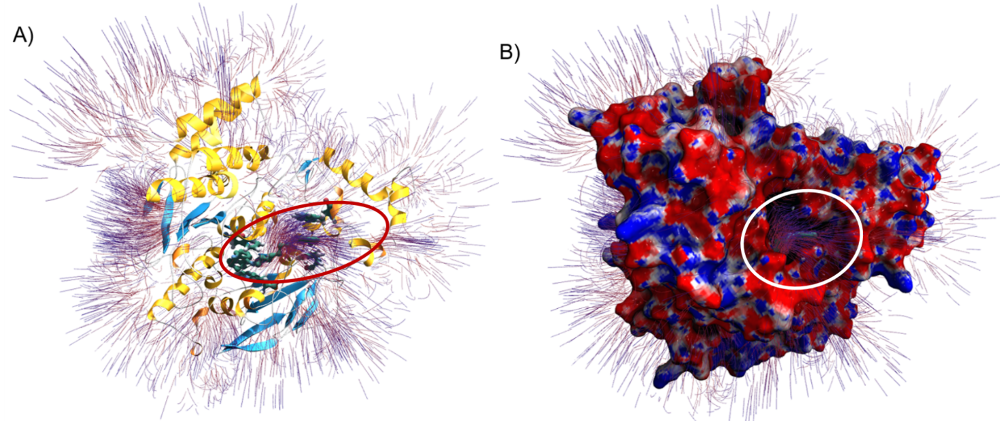

# Virtual Reality capability with APBS and PDB2PQR
APBS tools have been coupled with a virtual reality platform, UnityMol-APBS, to provide a powerful immersive experience to visualize and compare calculated results. the instructions for downloading the needed software to perform the VR analysis, are discussed in the following section.

## Download Software

- Download UnityMol-APBS-PS.zip from “XX”
- Unzip UnityMol-APBS-PS.zip
  - New folder UnityMol-APBS-PS contains three files
    - UnityMol-APBS.zip
    - APBS-PDB2PQR.zip
- Unzip UnityMol-APBS
  - New folder contains UnityMol.exe
  - it is preferable to put this somewhere on the users C:\ drive.
    - Not completely necessary
  - Launch UnityMol.exe
    - Starts in VR mode
- Unzip APBS-PDB2PQR.zip
  - New folder contains three directories: apbs, pdb2pqr, OutputFiles
  - To use default file locations, place the new folder “APBS-PD2PQR” in the root C:\ directory. i.e. “C:\APBS-PDB2PQR”
  - APBS and PDB2PQR can be used from the command line using the executables within their respective folders. 

# UI for UnitMol-APBS:

Figure 1: UnityMol-APBS user interface for PDB2PQR and APBS. (A) The main UnityMolAPBS menu; orange box highlights the two buttons used to open the APBS and PDB2PQR tools. (B) The main menu for interactions with APBS and PDB2PQR. Blue boxes show the
buttons to launch PDB2PQR and APBS executables, green boxes show the location of the options used for producing the image in Figures 2, and the purple boxes highlight the two input fields required to use custom force fields and custom residue names.

## Example
Analysis of the electrostatic surface potentials and electrostatic field lines of *Torpedo californica* acetylcholinesterase.
PROPKA is an empirical method provided with the PDB2PQR tools. This method uses a heuristic method to compute pKa perturbations due to desolvation, hydrogen bonding, and charge–charge interactions. Instructions provided for analysis of *Torpedo californica* acetylcholinesterase can act as a template for other custom uses with APBS tools in UnityMol-APBS:

Figure 2: Electrostatic surface potential and field lines of Torpedo californica AChE (PDBID 5EI5) with bound alkylene-linked bis-tacrine. (A) Electrostatic field lines and protein secondary structure shown with alpha helices (yellow), beta sheets (blue), and random coils (white). Residues Tyr70, Trp84, Trp279, and Phe330 are shown interacting with alkylene-linked bis-tacrine via hydrogen bonding and π-π stacking interactions. The red oval highlights the potential gradient. (B) AChE surface model with field lines and mapped electrostatic surface potentials shown with neutral, negative, and positive charges in white, red, and blue, respectively. Field lines are calculated from a gradient (value of 0.2) and depicted with the starting points in red and the ending points in blue. The orientation is the same in Figures A and B, where the alkylene-linked bis-tacrine can be seen occupying the catalytic gorge. The white circle highlights the potential gradient exiting the catalytic gorge.

An example of the electrostatic surface potential and electrostatic field lines of *Torpedo californica* AChE is shown in the supplementary information video available at https://www.youtube.com/watch?v=mnMDt_Z9pf0.

#### Steps involved in the VR Example
Example: Step-by-step directions for AChE VR visualization in Figure 2.
1. Open UnityMol-APBS (VR or desktop)
2. Load 5ei5.pdb file
3. Open PDB2PQR panel
4. Choose options (examples below) or run the default (default force field is AMBER)
   - apbs-input generates input file necessary for APBS
   - drop-water removes explicit water molecules from structure
   - summary writes atom names and sequence to a new file
   - salt writes salt bridge donor and acceptor atoms to a new file
   - hbond writes hydrogen bonding donors and acceptors to a new file

    The resulting .hbond and .salt files can be loaded as a new selection in UnityMol-APBS
    
5. Select “all(5EI5)” and run PDB2PQR
6. 5ei5X.pqr is written to a file and is immediately loaded for the user.
7. Select “all(5EI5)” and run APBS
8. 5ei5X.dx is created and loaded into the selection “all(5EI5X)” automatically
9. Select the “+” button on the “all(5EI5X)” selection tab, then select “surface”
10. Select “color by charge”
11. Select the “+” button on the “all(5EI5X)” selection tab, then select “field lines”

#### Output Python code from UnityMol-APBS for the VR Example
Example: Output Python code from UnityMol-APBS for AChE VR visualization in Figure 2.

     load("D:/5EI5_May/5ei5.pdb", True, False)
     
     load("D:/5EI5_May/5ei5X.pqr", True, False)
     
     loadDXmap("5ei5X", "D:/5EI5_May/5ei5X.dx")
     
     showSelection("all(5ei5X)", "fl")
     
     showSelection("all(5ei5X)", "s")
     
     colorByCharge("all(5ei5X)", "s")
     
     #UnityMol Specific functions ------------
     
     #Save parent position
     
     setMolParentTransform(Vector3(169.7430, -26.8734, -168.5344),
     
          Vector3(0.0178, 0.0178, 0.0178),
          
          Vector3(0.0000, 0.0000, 0.0000),
          
          Vector3(0.5442, 1.4145, 1.0517))

