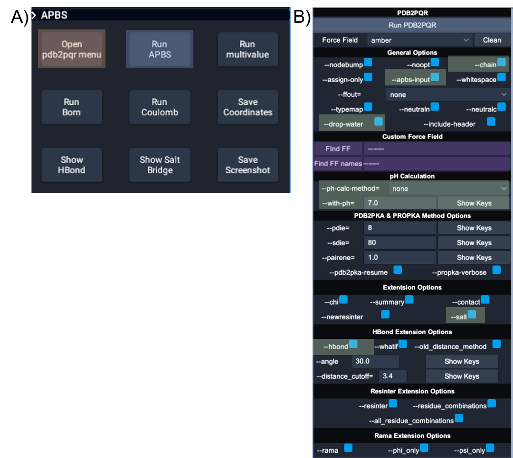

# Virtual Reality capability with APBS and PDB2PQR
APBS tools have been coupled with a virtual reality platform, UnityMol-APBS, to provide a powerful immersive experience to visualize and compare calculated results. the instructions for downloading the needed software to perform the VR analysis, are discussed in the following section.

## Download Software
**download instuctions go here**
APBS executables must be placed in the users C:/ folder (note: the directory names must not be changed).

UI for UnitMol-APBS:

UnityMol-APBS user interface for PDB2PQR and APBS. (A) Orange box high-lights the two buttons used to open the APBS and PDB2PQR tools from the main UnityMol-APBS menu. (B) and (C) show main menu for interactions with APBS and PDB2PQR. Blue boxes show the main buttons to launch PDB2PQR and APBS executables, green boxes show the location of the main options used for producing the images in Figures 2 and 3, and the purple boxes highlight the two input fields required to use custom force fields and custom
residue names.

## Example
Analysis of the electrostatic surface potentials and electrostatic field lines of *Torpoedo californica* acetylcholinesterase.
PROPKA is an empirical method provided with the PDB2PQR tools. This method uses a heuristic method to compute pKa perturbations due to desolvation, hydrogen bonding, and charge–charge interactions. Instructions provided for analysis of *Torpoedo californica* acetylcholinesterase can act as a template for other custom uses with APBS tools in UnityMol-APBS:

Electrostatic surface potential and field lines of *Torpedo californica* AChE (PDB ID 5EI5). (A) Electrostatic field lines and protein secondary structure shown with alpha helices (yellow), beta sheets (blue), and random coils (white). (B) AChE surface model with field lines and mapped electrostatic surface potentials shown with neutral, negative, and positive charges in white, red, and blue, respectively. Field lines are calculated from a gradient and depicted with the starting points in red and the ending points in blue.

#### Steps involved in the VR Example
1.	Open UnityMolX (VR or desktop)
2.	Load molName.pdb file 3. Open PDB2PQR panel
4.	Choose options (examples below) or run the default. Default force field is AMBER.
     - apbs-input generate input file necessary for APBS drop-water removes explicit water molecules from structure summary exports atom names and sequence as output
     - salt exports salt bridge donor and acceptor atoms; the resulting file can be loaded as a new selection in UnityMolX
     - hbond exports hydrogen bond donor and acceptor atoms; the resulting file can be loaded as a new selection in UnityMolX
5.	Run PDB2PQR
6.	Load molNameX.pqr
7.	Open APBS panel
8.	Run the default options
9.	Resulting file will be named molNameX.pqr.dx. Navigate to the parent folder and remove .pqr from the .dx filename; e.g., molNameX.pqr.dx → molNameX.dx
10.	Load molNameX.dx
11.	Click “+” button on molNameX selection tab → surface
12.	Click color by charge
13.	Click “+” button on molNameX selection tab → field lines

#### Output Python code from UnityMol-APBS for the VR Example
load("D:/5EI5_May/5ei5.pdb", True, False) load("D:/5EI5_May/5ei5X.pqr", True, False) loadDXmap("5ei5X", "D:/5EI5_May/5ei5X.dx")
showSelection("all(5ei5X)", "fl") showSelection("all(5ei5X)", "s") colorByCharge("all(5ei5X)", "s")

#UnityMol Specific functions ------------

#Save parent position

    setMolParentTransform(Vector3(169.7430, -26.8734, -168.5344),
    
        vector3(0.0178, 0.0178, 0.0178),
        
        Vector3(0.0000, 0.0000, 0.0000),
        
        Vector3(0.5442, 1.4145, 1.0517))
