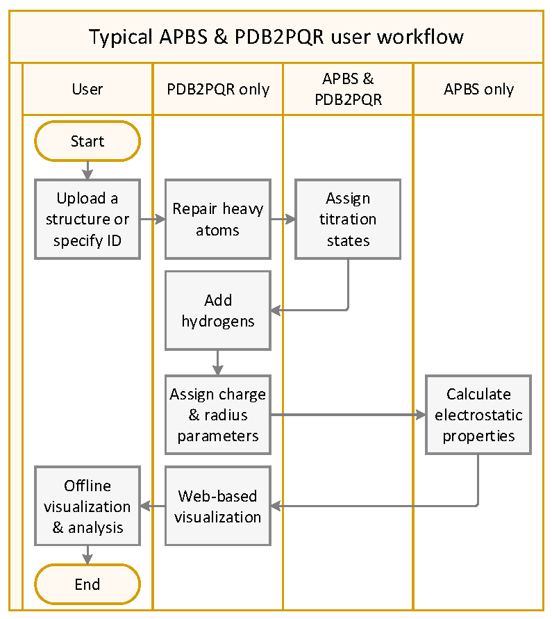

Getting started
===============

This section gives a basic overview of APBS-PDB2PQR workflows. 
It assumes that you have `registered <http://eepurl.com/by4eQr>`_ and obtained access to the software as described in :doc:`downloads`.

The basic APBS-PDB2PQR workflow involves a few simple steps, illustrated in the figure below and enumerated as:

#. Identify your molecular structure for by specifying a `PDB ID <http://www.pdb.org>`_ or uploading your own structure.
#. Use `PDB2PQR <https://github.com/Electrostatics/pdb2pqr>`_ to specify the titration state of the system, repair missing atoms, and assign parameters (charges and radii) to the atoms of your system.
#. Run :ref:`apbs` from within the `PDB2PQR web server <http://server.poissonboltzmann.org>`_ or via the command line.
#. Visualize the results from within the web server or via other software.

Please see the `PDB2PQR documentation <http://pdb2pqr.readthedocs.io>`_ for more information about PDB2PQR usage.
